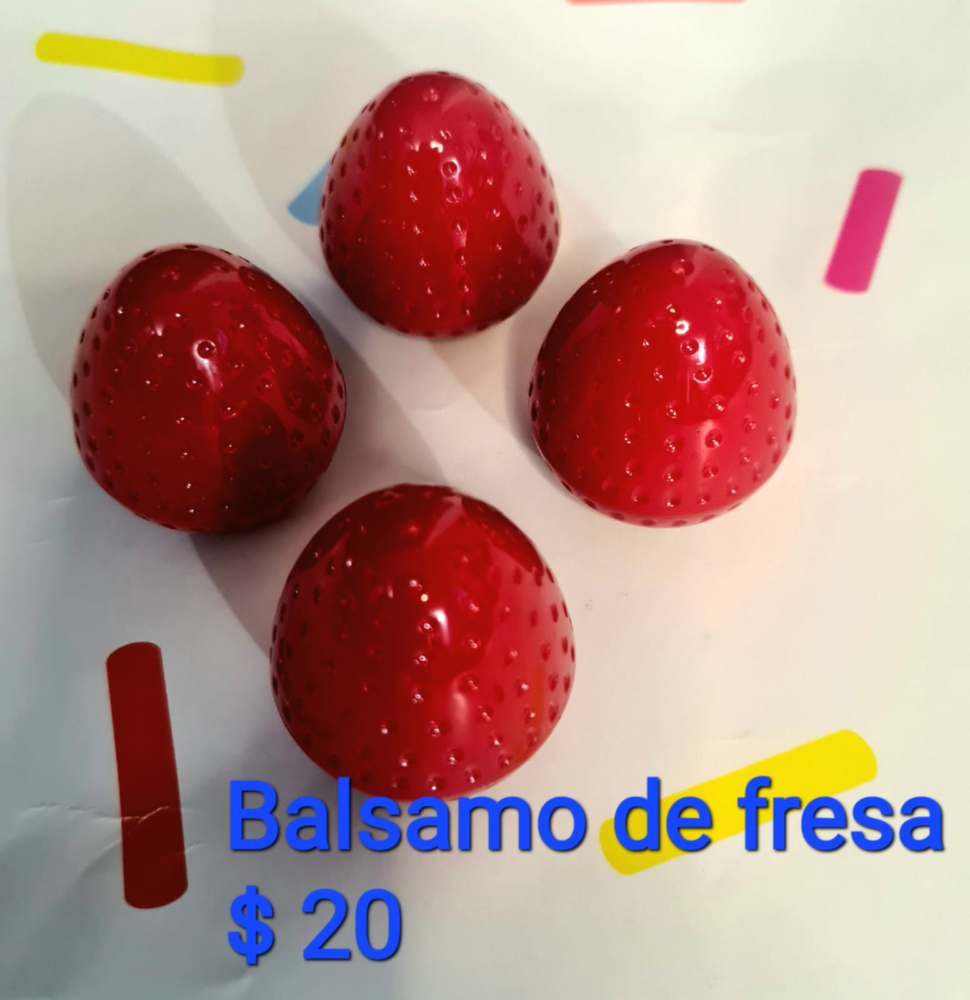
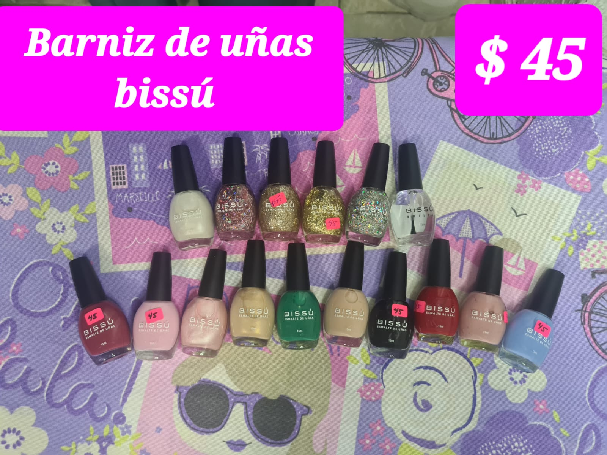
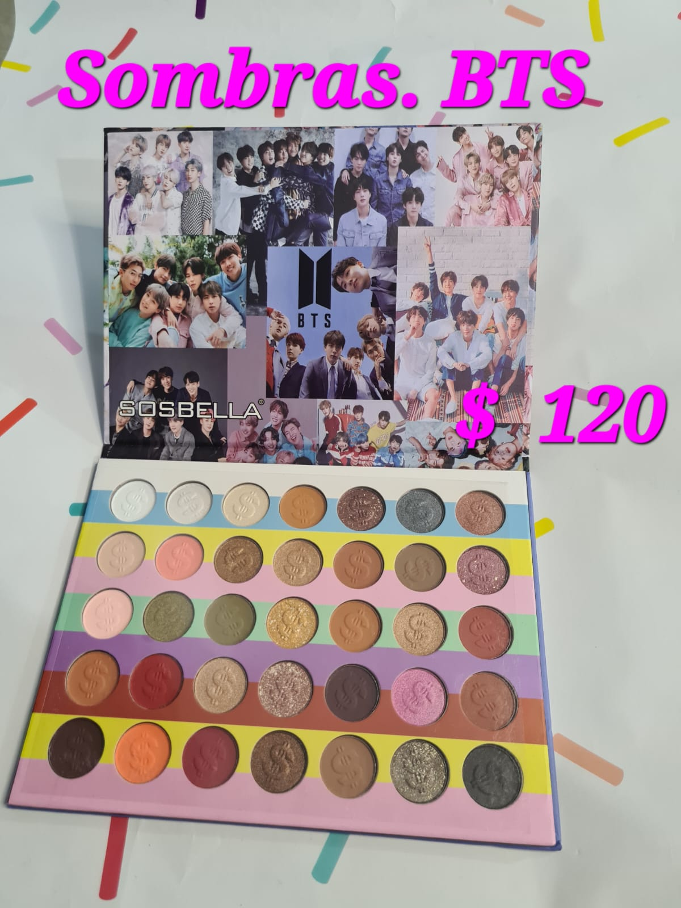
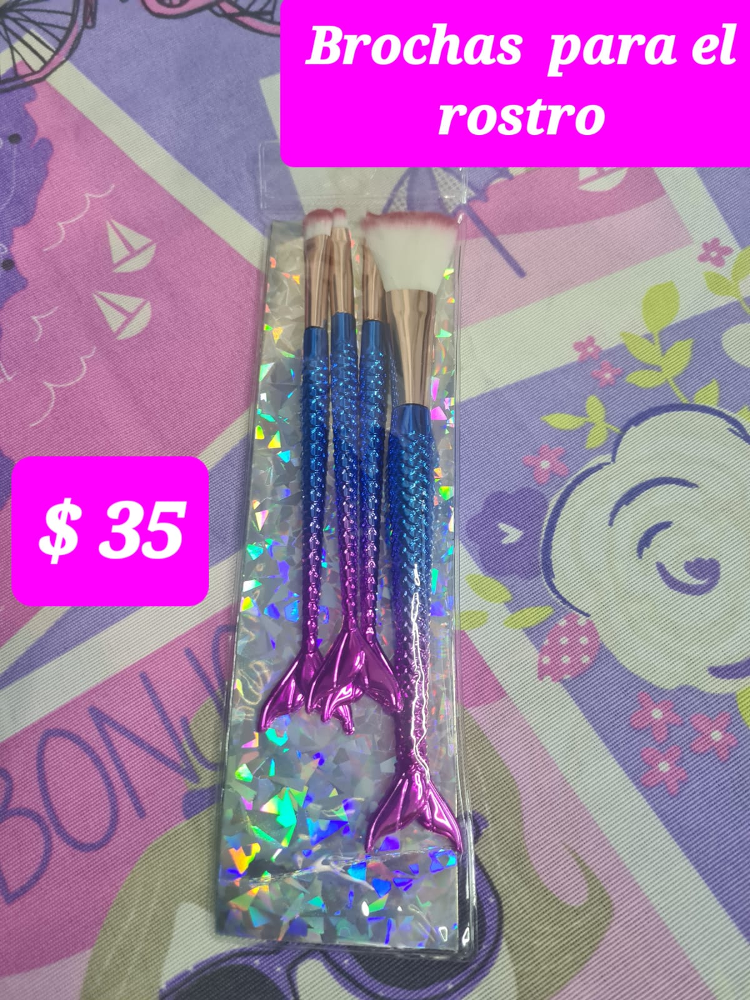
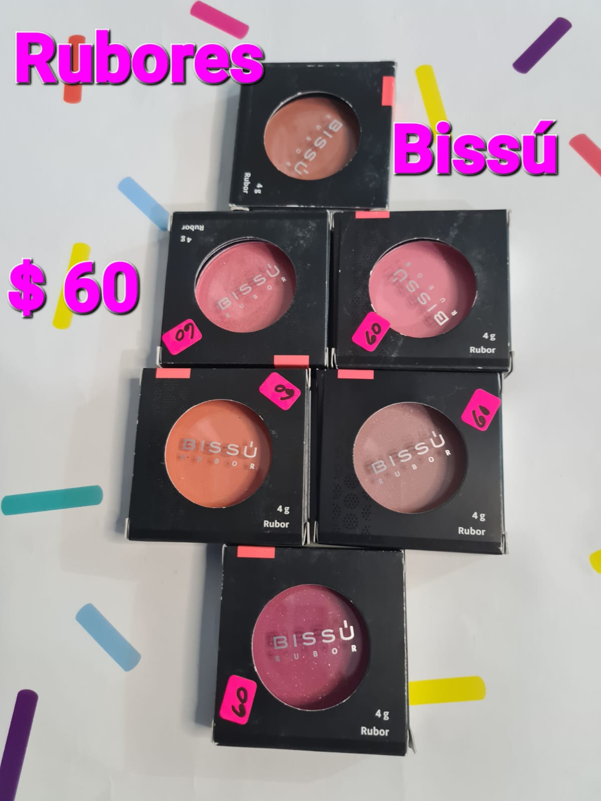
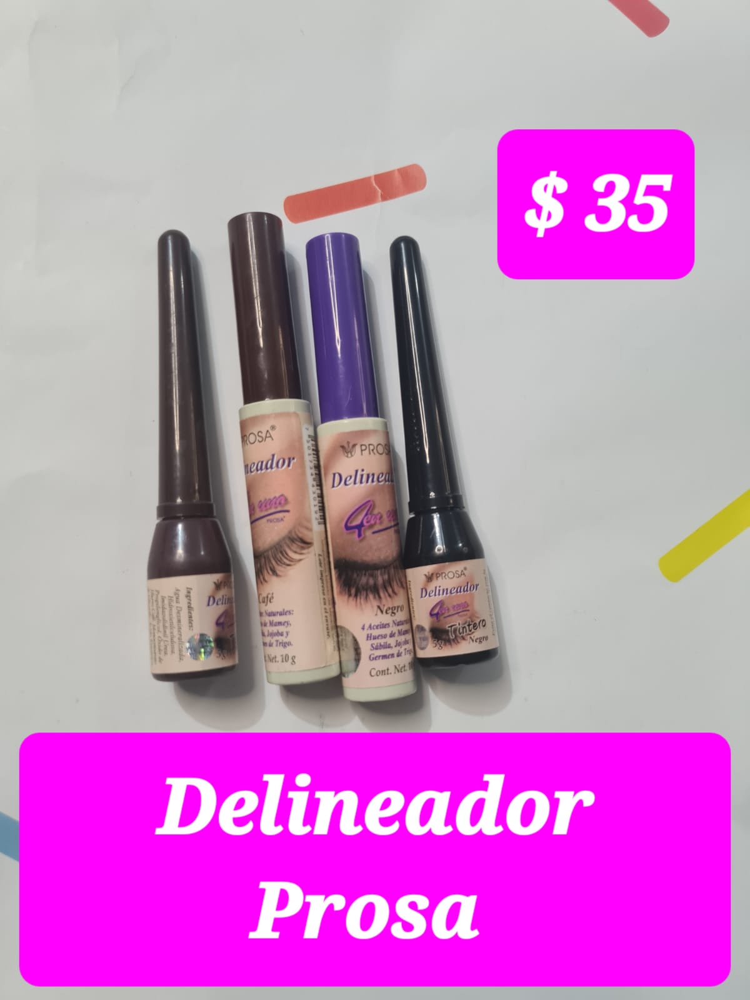
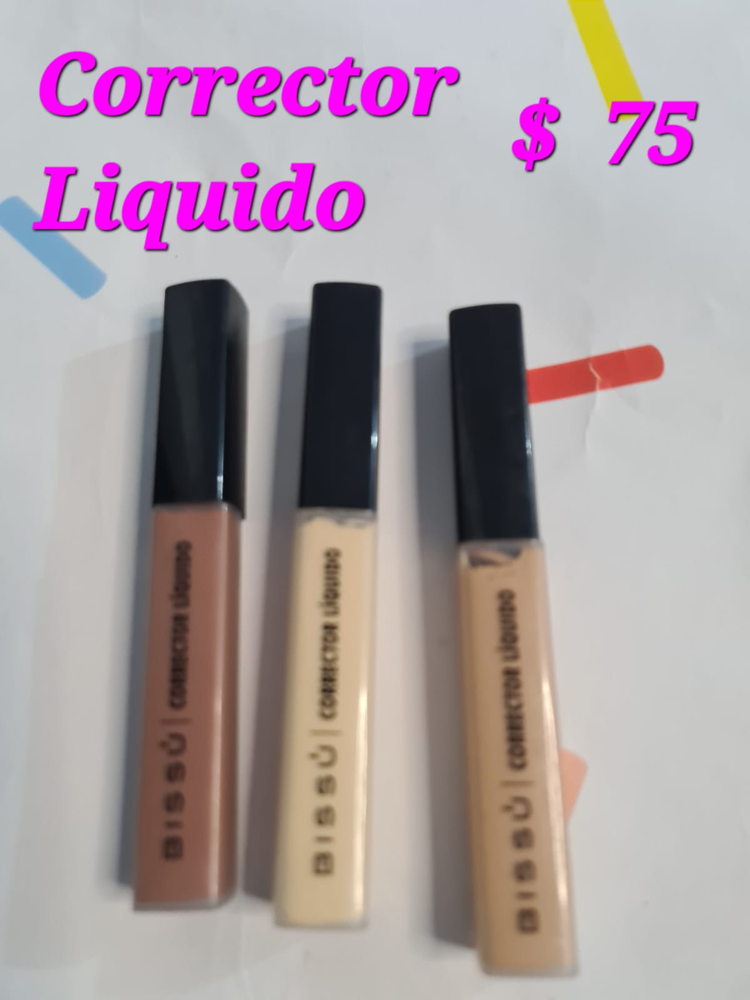
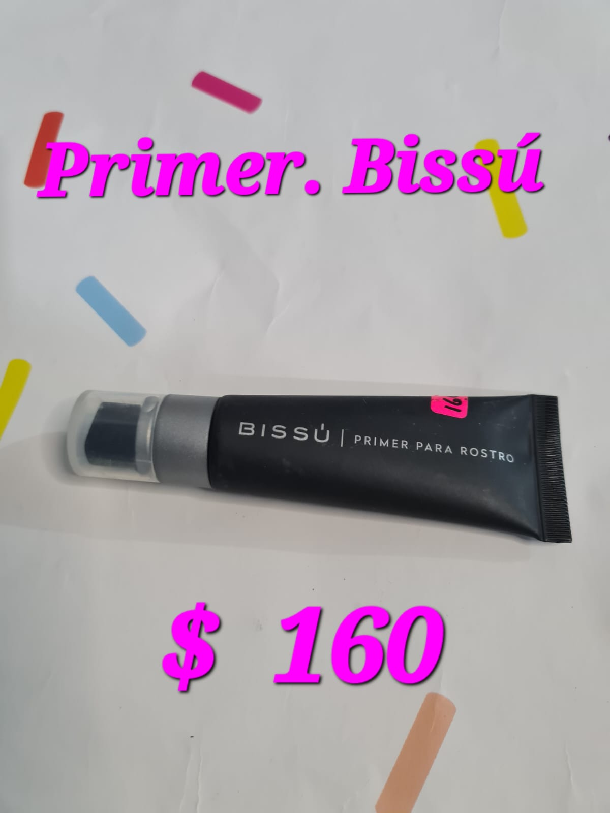
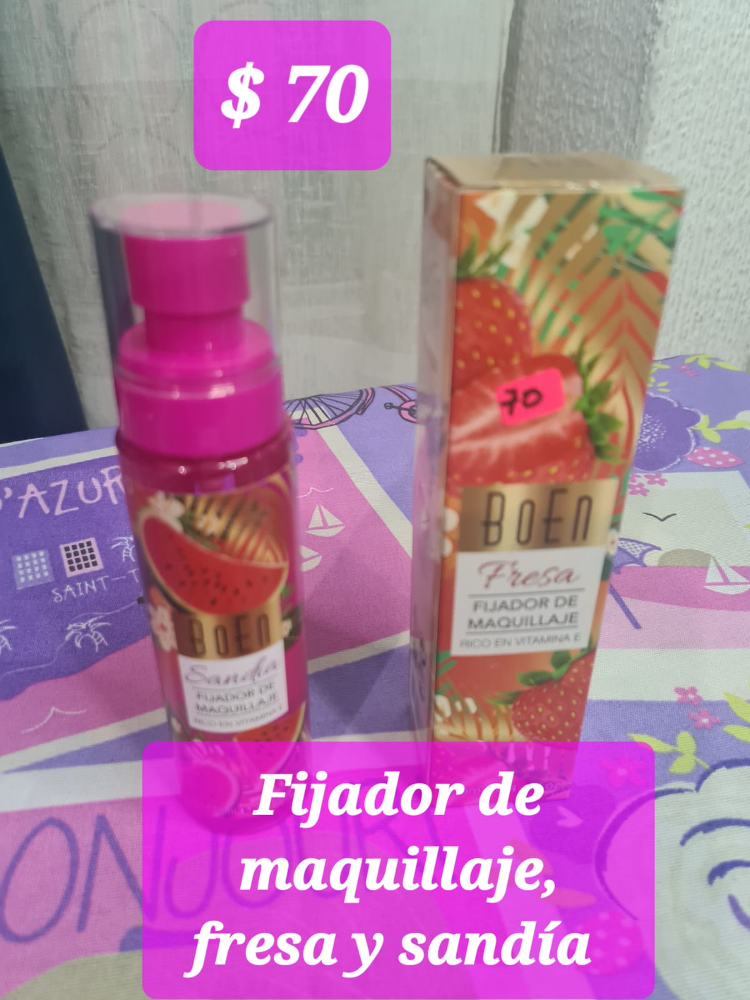

<!DOCTYPE html>
<html lang="es">
<head>
    <meta charset="UTF-8">
    <meta name="viewport" content="width=device-width, initial-scale=1.0">
    <title>Lista de Productos</title>

    <link rel="stylesheet" href="estilosp.css">
</head>

<body>

    <!-- ENCABEZADO -->

    <header>

        <h1>Paradise Beauty</h1>

        <nav>
            <a href="Pagina.html">Inicio</a>
            <a href="Productos.html">Productos</a>
            <a href="Bolsa de compras.html">Bolsa de Compras</a>
            <a href="Contacto.html">Contacto</a>
        </nav>

    </header>

    <!-- TITULO -->

    <section class="titulo-productos">

        <h2>Catálogo de Maquillaje</h2>

        

            Descubre todos nuestros productos de belleza.
        

    </section>

    <!-- LISTA DE PRODUCTOS -->

    <section class="lista-productos">

        

            
            <h3>Balsamo con diseño de fresa</h3>
            
Balsamo con diseño, colo y sabor de  fresa.

            <button onclick="agregarAlCarrito('Balsamo',20)">
                Agregar al carrito
            </button>
        

        

            
            <h3>Barniz de uñas marca bissú</h3>
            
$45 MXN

            <button onclick="agregarAlCarrito('Barniz de uñas',45)">
                Agregar al carrito
            </button>
        

        

            
            <h3>Paleta de Sombras con diseño de bts</h3>
            
$120 MXN

            <button onclick="agregarAlCarrito('Paleta de Sombras',120)">
                Agregar al carrito
            </button>
        

        

            
            <h3>Kit de Brochas</h3>
            
$35 MXN

            <button onclick="agregarAlCarrito('Kit de Brochas',35)">
                Agregar al carrito
            </button>
        

        

            
            <h3>Rubor Rosado</h3>
            
$60 MXN

            <button onclick="agregarAlCarrito('Rubor',60)">
                Agregar al carrito
            </button>
        

        

            
            <h3>Rímel Explosiva y Exactitud</h3>
            
$50 MXN

            <button onclick="agregarAlCarrito('Rimel',50)">
                Agregar al carrito
            </button>
        

        

            
            <h3>Delineador Negro</h3>
            
$35 MXN

            <button onclick="agregarAlCarrito('Delineador',35)">
                Agregar al carrito
            </button>
        

        

            
            <h3>Corrector HD</h3>
            
$75 MXN

            <button onclick="agregarAlCarrito('Corrector',75)">
                Agregar al carrito
            </button>
        

        

            
            <h3>Primer Facial</h3>
            
$160 MXN

            <button onclick="agregarAlCarrito('Rubor',160)">
                Agregar al carrito
            </button>
        

        

            
            <h3>Spray Fijador de maquillaje</h3>
            
$70 MXN

            <button onclick="agregarAlCarrito('Spray fijador',70)">
                Agregar al carrito
            </button>
        

    </section>

    <!-- CARRITO -->

    <h2>Carrito de Compras</h2>
    <ul id="carrito"></ul>
    <h3>Total: $0</h3>
    <button onclick="vaciarCarrito()">
        Vaciar carrito
    </button>
      
    <a href="Bolsa de compras.html" class="boton-carrito">
        Ir a mi bolsa de compras
    </a>

    
    <!-- FOOTER -->

    <footer>

        

            © 2026 Paradise Beauty |
            Todos los derechos reservados
        

    </footer>

</body>
</html>
